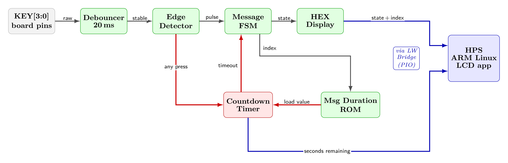
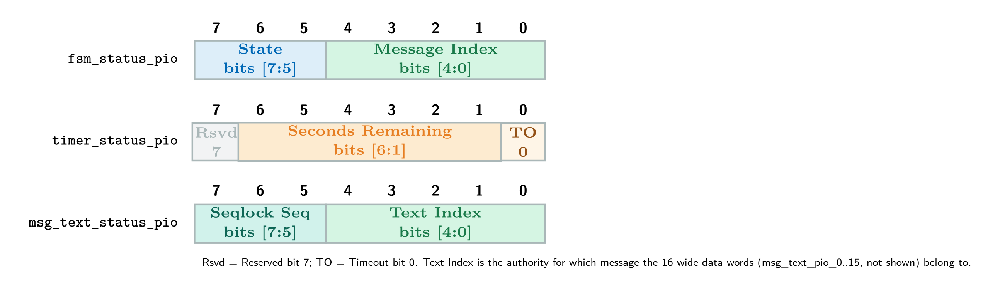
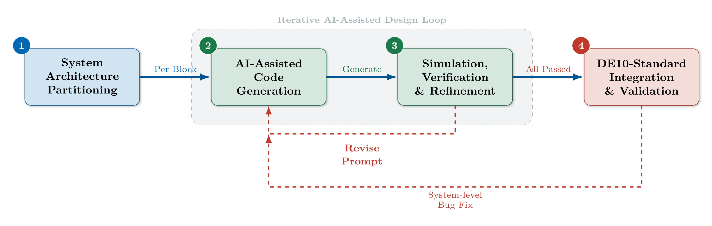
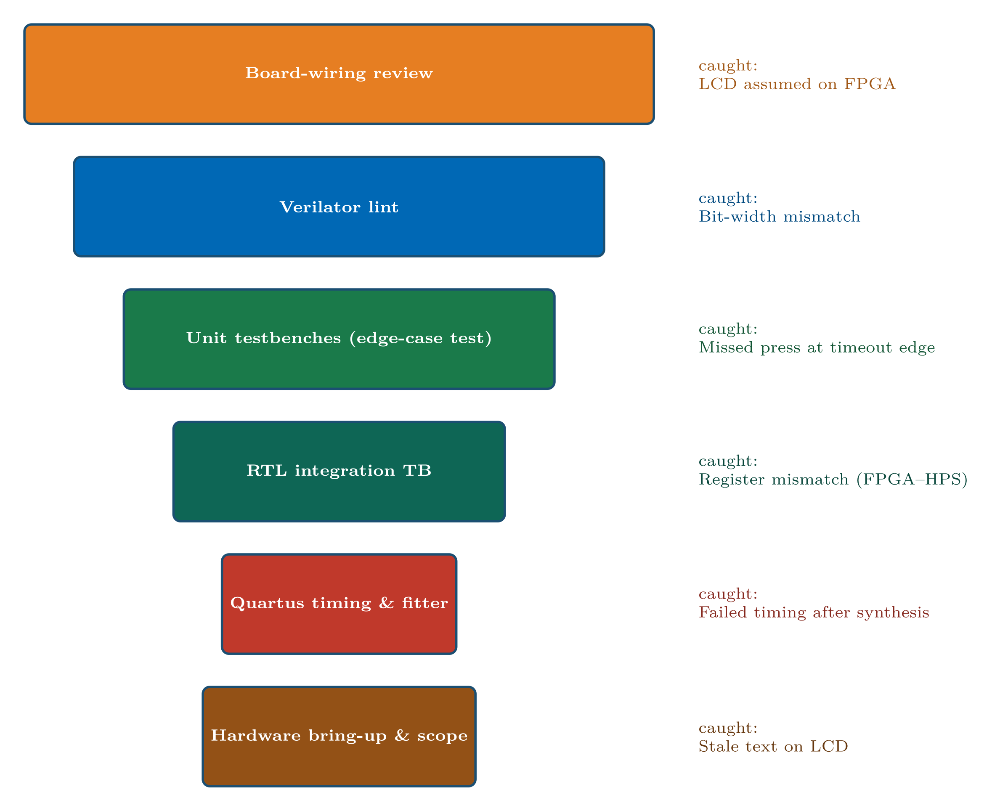
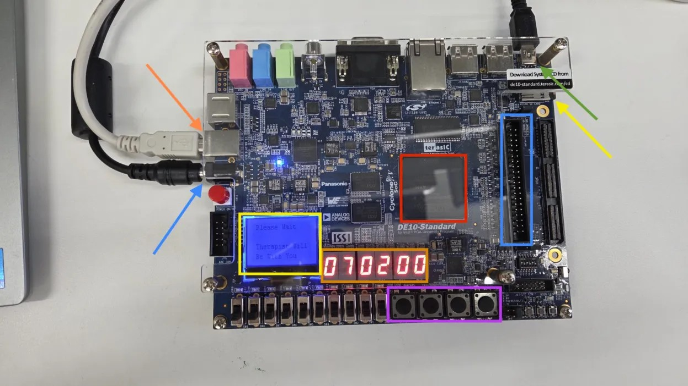
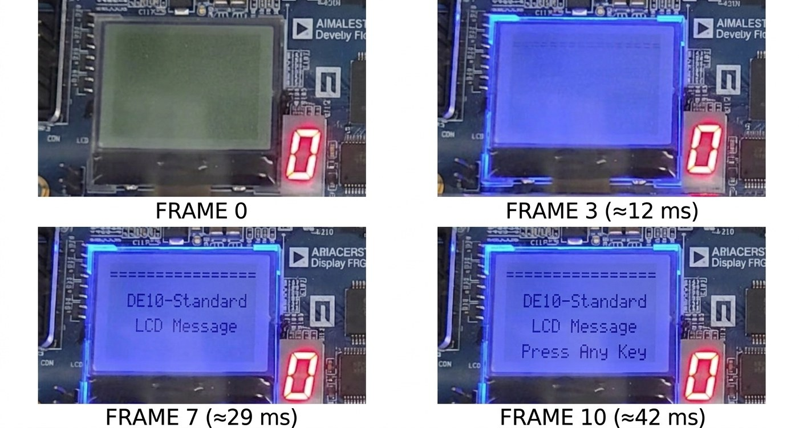
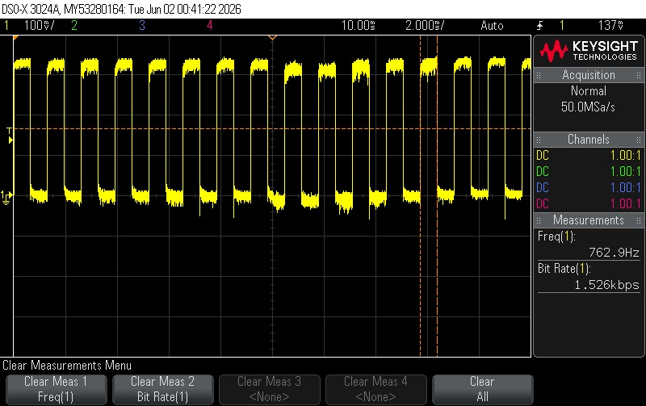

# DE10-Standard LCD Message System

Real-time LCD message board for a physiotherapy room, built on the Terasic DE10-Standard (Cyclone V FPGA + ARM HPS). Also a case study in simulation-gated AI development: **AI tools draft every module, but nothing reaches hardware until it passes a simulation gate.** Result: all requirements met at first power-on, zero hardware bugs.

[](LICENSE)
[](https://www.terasic.com.tw/cgi-bin/page/archive.pl?Language=English&No=1046)
[](https://www.intel.com/content/www/us/en/products/details/fpga/cyclone/v.html)
[]()
[]()

<p align="center">
  
</p>

## At a Glance

**18** messages · **4** buttons · **42 ms** worst-case latency (< 50 ms target) · **7%** FPGA logic used · **0** / 10,000 bridge errors

Buttons wire only to the FPGA, and the LCD wires only to the HPS. That physical fact set the architecture.

## Architecture

<p align="center">
  
  
</p>

The FPGA owns the real-time path (debounce → edge detect → FSM → timer) and exposes read-only status registers. The HPS polls them over the Lightweight Bridge (`0xFF200000`) and renders the LCD; it never writes back.

| Module | Role |
|---|---|
| `button_debouncer.v` | 20 ms stability counter (1,000,000 cycles @ 50 MHz) |
| `button_edge_detector.v` | one pulse per press |
| `message_fsm.v` | 5-state Moore FSM |
| `idle_timer.v` | runtime-loadable countdown |
| `msg_duration_rom.v` | per-message duration lookup (0–17) |
| `hex_display.v` | seconds / last button / message number to 7-segment |

## Register Map & FSM

<p align="center">
  
  
</p>

| PIO | Offset | Fields |
|---|---|---|
| `fsm_status_pio` | `0x6000` | [7:5] state · [4:0] message index |
| `timer_status_pio` | `0x7000` | [0] timeout · [6:1] seconds remaining |

INIT → IDLE → HOME → MSG, with HOME/IDLE timing out to SLEEP and MSG auto-advancing (wrap). **On a tie, the button always beats the timer.**

## HPS Software

<p align="center">
  
</p>

`main.c` polls the registers every 5 ms and redraws only on change. No message text crosses the bridge: all 18 strings live in `messages.h`, and the FPGA sends only a 5-bit index.

## Simulation-Gated AI Development

<p align="center">
  
  
</p>

Verilog was drafted with Claude Code, and the HPS C application with Codex. No code reaches the board until its testbench passes: a failing test revises the prompt, and a hardware bug loops back to generation. Six defects were caught this way, all traced to under-specified prompts rather than model limits:

| Defect | Caught by |
|---|---|
| LCD assumed wired to FPGA | Board wiring review |
| Register layout mismatch | Wrong text on LCD |
| Bit-width mismatch | Verilator lint |
| Failed timing closure | Quartus timing report |
| Stale LCD text | Manual screen check |
| Missed press at timeout edge | Edge-case test |

> **Weak:** *"...using a Nios II soft-core processor to drive the display."* No wiring facts were given, so the model defaulted to a generic pattern.
> **Strong:** *"The KEY[0–3] buttons are wired only to FPGA fabric pins, the LCD only to the Processor."* Wiring is stated as fact, leaving no room for assumption.

## The Real Hardware

<p align="center">
  
</p>

## Results

<p align="center">
  
  
  
</p>

| Metric | Result | Target |
|---|---|---|
| Display latency | 42 ms (camera, 240fps) | < 50 ms |
| FPGA logic | 7% (3,073 / 41,910 ALMs) | < 75% |
| Bridge reliability | 0 errors / 10,000 reads | 0 |
| Button debounce | 0 false triggers | 0 |

Eight testbenches (`tb_button_debouncer`, `tb_button_edge_detector`, `tb_message_fsm`, `tb_idle_timer`, `tb_hex_display`, `tb_soc_register_contract`, `tb_fpga_msg_controller`, `tb_clock_divider`) required zero errors before any module reached hardware.

## Repository Structure

```
├── hw/rtl/           Verilog RTL modules
├── hw/quartus/       Quartus project + pin assignments
├── sw/hps_app/       HPS C application + Makefile
├── sim/testbenches/  8 Verilog simulation testbenches
├── scripts/          Build, deployment, hardware sign-off automation
├── assets/           Diagram sources (TikZ) + rendered images/photos
└── README.md
```

## Build

**FPGA (Windows):**
```
.\hw\quartus\fix_then_build.ps1    # fixes Qsys, compiles DE10_Standard_GHRD.sof
```
Program with Quartus Programmer.

**HPS software (on-board):**
```
cd sw/hps_app && make && ./lcd_msg_app
```

**HPS software (Windows, via WSL cross-compile):**
```
wsl -d Ubuntu -- bash -lc "cd /mnt/c/Fpga_project_DE10_Standard_LCD_MSGS_-V2/sw/hps_app && make CC=arm-linux-gnueabihf-gcc"
```

**Simulate before flashing:**
```
.\sim\run_all_sim.ps1                    # canonical regression
.\sim\run_pre_board_verification.ps1     # full pre-board gate
```

## Future Work

VGA display · Wi-Fi message streaming · audio feedback · touchscreen input · SD-card message library · power management (~30–40% cut) · exhaustive bridge-integrity test · scope-based hardware coverage.

## Credits

Built by **Amit Damari** and **Ido Zylberman**, advised by **Eytan Mann**, Digital Systems Laboratory, Tel Aviv University. Project 3420, EE Final Year, 2025–26.

Released under the [MIT License](LICENSE).
