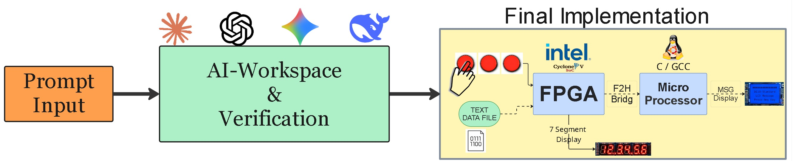
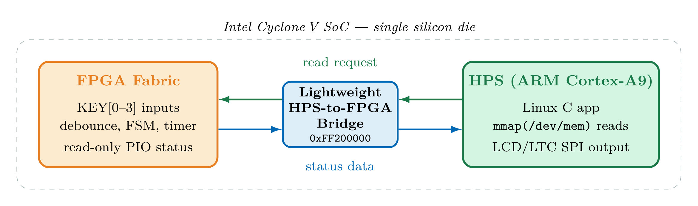
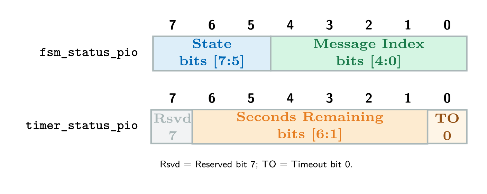
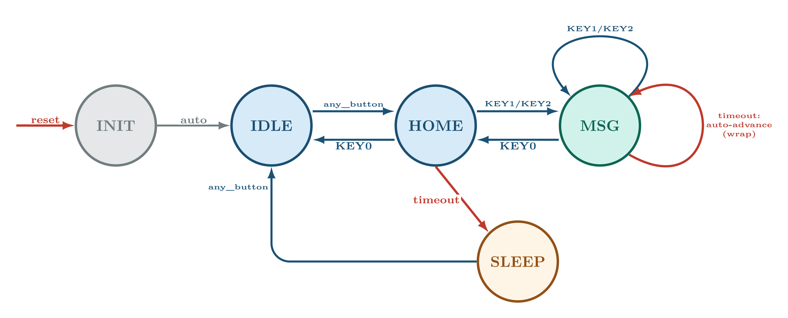
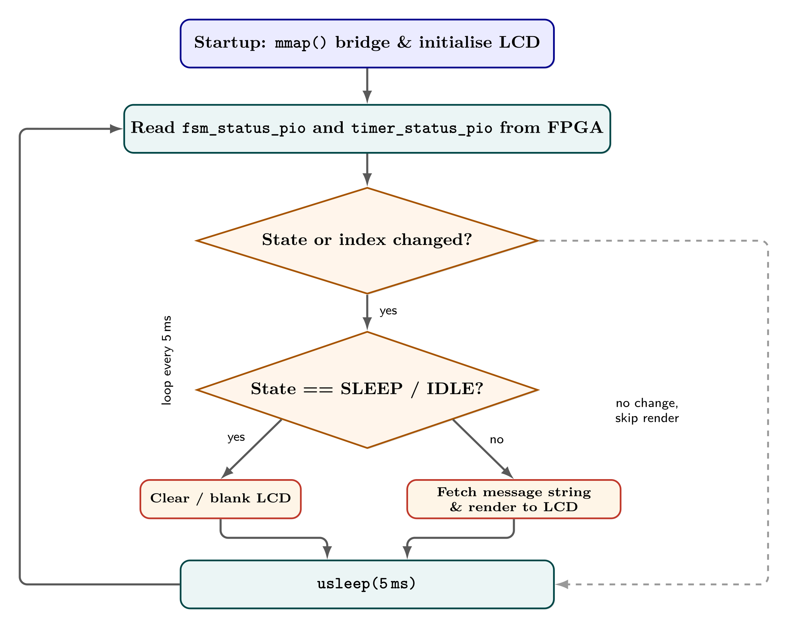
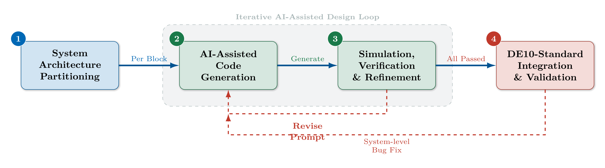
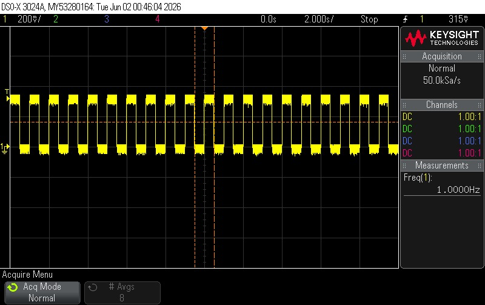

# DE10-Standard LCD Message System

**Can AI-generated code be trusted in a deterministic FPGA↔HPS system?**
A simulation-gated, AI-assisted case study on the Terasic DE10-Standard, built for a physiotherapy treatment room.

[](LICENSE)
[](https://www.terasic.com.tw/cgi-bin/page/archive.pl?Language=English&No=1046)
[](https://www.intel.com/content/www/us/en/products/details/fpga/cyclone/v.html)
[]()
[]()
[]()

<p align="center">
  
</p>

AI tools draft every module — Verilog/RTL with **Claude Code**, the HPS C app with **Codex** — but nothing reaches hardware until it passes a dedicated simulation gate. **Result: all five requirements met at first power-on, zero hardware bugs.**

## Table of Contents

- [At a Glance](#at-a-glance)
- [System Block Diagram](#system-block-diagram)
- [Inside the FPGA — the Real-Time Datapath](#inside-the-fpga--the-real-time-datapath)
- [Register Map](#register-map)
- [Finite State Machine](#finite-state-machine)
- [HPS Software — Reading the Board, Updating the LCD](#hps-software--reading-the-board-updating-the-lcd)
- [Development Methodology](#development-methodology)
- [What the Prompts Reveal](#what-the-prompts-reveal)
- [The Real Hardware](#the-real-hardware)
- [Verification & Results](#verification--results)
- [Hardware & Software Components](#hardware--software-components)
- [Repository Structure](#repository-structure)
- [Build Instructions](#build-instructions)
- [Simulation Verification (Pre-Hardware)](#simulation-verification-pre-hardware)
- [Hardware Validation (Presentation Sign-off)](#hardware-validation-presentation-sign-off)
- [Future Work](#future-work)
- [References](#references)
- [Credits](#credits)

## Recent Highlights

*   **Per-message auto-advance slideshow** — each message displays for its own duration (`msg_duration_rom.v`) then auto-advances; manual KEY0/1/2 always takes priority.
*   **60s HOME inactivity timeout** (was 15s) — only HOME sleeps; the MSG slideshow keeps cycling on its own.
*   **On-board demo indicators** — HEX0/1 show the active message number, LEDR[9] blinks on every countdown expiry.

## At a Glance

| | | | | |
|---|---|---|---|---|
| **18** messages | **4** buttons | **42 ms** worst-case latency (< 50 ms target) | **7%** FPGA logic used | **0** / 10,000 bridge errors |

Buttons wire only to the FPGA; the LCD wires only to the HPS — that physical fact, not a preference, set the architecture.

## System Block Diagram

<p align="center">
  
</p>

The FPGA owns the real-time control path (debounce, edge detect, FSM, timer) and exposes read-only status registers. The HPS is the bridge master: it polls those registers over the **Lightweight HPS-to-FPGA Bridge** (`0xFF200000`, 32-bit Avalon-MM, `mmap()` on `/dev/mem`) and renders the message. No writes flow HPS→FPGA — the HPS has no authority over control transitions.

## Inside the FPGA — the Real-Time Datapath

<p align="center">
  
</p>

| Module | Role |
|---|---|
| `button_debouncer.v` | 20 ms stability counter, `N = 50×10⁶ × 20×10⁻³ = 1,000,000` cycles |
| `button_edge_detector.v` | one clean pulse per physical press |
| `message_fsm.v` | 5-state Moore FSM; reloads the timer, picks the message index |
| `idle_timer.v` | runtime-loadable countdown — 60s on HOME/IDLE, or the current message's own duration |
| `msg_duration_rom.v` | per-message duration lookup (0–17) |
| `hex_display.v` | timer seconds / last button / message number → 7-segment |

All wrapped in `fpga_msg_controller.v`. The HPS only ever reads.

## Register Map

<p align="center">
  
</p>

| PIO Name | Offset | Width | Description |
|---|---|---|---|
| `button_pio` | `0x5000` | 4-bit | Raw button inputs (original). |
| `fsm_status_pio` | `0x6000` | 8-bit | [7:5] FSM state · [4:0] message index. |
| `timer_status_pio` | `0x7000` | 8-bit | [0] timeout flag · [6:1] seconds remaining · [7] reserved. |

All accesses are `volatile` in the HPS app, to prevent the compiler caching stale values. This exact contract, stated explicitly rather than left implicit, is what the "register mismatch" defect below was missing.

## Finite State Machine

<p align="center">
  
</p>

| State | Meaning |
|---|---|
| INIT | Power-on / reset |
| IDLE | Auto-advances to HOME |
| HOME | 60s idle → SLEEP; any button → MSG |
| MSG | One of 18 messages; auto-advances (wrap) on its own duration; KEY1/KEY2 navigate |
| SLEEP | LCD blanked; any button wakes to IDLE |

Outputs depend only on the current state (Moore), so an HPS read is always stable. **On a tie, the button always beats the timer** — the rule an early AI draft got backwards.

## HPS Software — Reading the Board, Updating the LCD

<p align="center">
  
</p>

A single-threaded C app (`main.c`), state extracted as `(fsm_status >> 5) & 0x07`, index as `fsm_status & 0x1F`. No message text crosses the bridge — all 18 strings live in `messages.h`; the FPGA sends only the 5-bit index. Check the board, redraw only on change, every 5 ms.

## Development Methodology

<p align="center">
  
</p>

**No code reaches the board until its test passes.** Two feedback loops: a failing test revises the prompt; a hardware-level bug loops back to generation. This gate is why bring-up needed zero bug-fix loops.

<p align="center">
  
</p>

Six narrowing gates, each catching a different defect class — simulation alone would have missed the timing and real-time cases that only Quartus and hardware bring-up expose.

| # | Defect | Caught by | Root cause |
|---|---|---|---|
| 1 | LCD assumed wired to FPGA | Board wiring review | Prompt omitted the real board wiring |
| 2 | Register layout mismatch, FPGA↔HPS | Wrong text on LCD | Prompt gave no exact bit-field contract |
| 3 | Bit-width mismatch | Verilator lint | Prompt set no explicit signal widths |
| 4 | Failed timing closure | Quartus timing report | Prompt stated no timing/f_max constraint |
| 5 | Stale text after a state change | Manual screen check | Prompt never specified redraw ordering |
| 6 | Missed press at a timeout edge | Dedicated edge-case test | Prompt named no button-priority rule |

Every defect traced to an under-specified prompt, never a model limit — the fix was always a more complete prompt.

## What the Prompts Reveal

> **Weak:** *"Design an LCD control system on the DE10-Standard board using a Nios II soft-core processor to drive the display."*
> No wiring facts — the model defaulted to a generic Nios II tutorial pattern.
>
> **Strong:** *"...The KEY[0–3] buttons are wired only to FPGA fabric pins, and the LCD is wired only to the Processor."*
> Wiring stated as fact — no room for an assumption.

> **Weak:** *"Add timeout handling so the display sleeps after inactivity and advances messages automatically."*
> Names the feature, not the arbitration rule — the bug only appears when two events coincide.
>
> **Strong:** *"...with explicit priority. If a button event and a timer expiry occur on the same clock cycle, the button event must win."*
> States the tie-break rule — testable in simulation.

## The Real Hardware

<p align="center">
  
  
</p>

**Yellow** = LCD (HPS side) · **orange** = HEX display (FPGA side) · **magenta** = KEY buttons (FPGA side) · **red** = Cyclone V SoC · **blue** = GPIO header.

## Verification & Results

Eight testbenches, zero errors required before any module reached hardware: `tb_button_debouncer`, `tb_button_edge_detector`, `tb_message_fsm`, `tb_idle_timer`, `tb_hex_display`, `tb_soc_register_contract`, `tb_fpga_msg_controller`, `tb_clock_divider`.

<p align="center">
  
</p>

Worst-case latency, camera-measured at 240 fps (4.2 ms/frame): full text on-screen by **frame 10 ≈ 42 ms**.

<p align="center">
  
  
</p>

Clock divider and 7-segment refresh, confirmed live on the GPIO pins with a Keysight scope: **1.0000 Hz** and **762.9 Hz**.

| Metric | Result | Target |
|---|---|---|
| Display update latency | 42 ms worst-case | < 50 ms |
| FPGA logic utilization | 7% (3,073 / 41,910 ALMs) | < 75% |
| Bridge communication reliability | 0 errors / 10,000 reads | 0 errors |
| Button debounce | 0 false triggers | 0 re-triggers |
| Hardware bugs at first power-on | 0 | — |

The 10,000-read bridge test confirms static-value read stability but not every bit line or simultaneous switching — see [Future Work](#future-work).

## Hardware & Software Components

*   `button_debouncer.v`, `button_edge_detector.v`, `idle_timer.v`, `msg_duration_rom.v`, `message_fsm.v`, `hex_display.v` — FPGA fabric modules (see table above).
*   `fpga_msg_controller.v` — top-level FPGA wrapper; `DE10_Standard_GHRD.v` — connects RTL to the HPS via Qsys.
*   `main.c` — HPS LCD renderer, consumes `fsm_status_pio` / `timer_status_pio`; `Makefile` — cross-compile or on-board build.

## Repository Structure

```
Fpga_project_DE10_Standard_LCD_MSGS/
├── hw/
│   ├── rtl/            Verilog RTL modules
│   └── quartus/        Quartus project + pin assignments
├── sw/hps_app/          HPS C application + Makefile
├── sim/testbenches/     8 Verilog simulation testbenches
├── scripts/             Build, deployment, hardware sign-off automation
├── docs/
│   ├── diagrams/        TikZ/LaTeX source for every diagram above
│   ├── images/          Rendered diagrams + real hardware photos
│   └── *.md             Architecture, requirements, verification, runbooks
└── README.md
```

Every diagram above has its LaTeX/TikZ source in [`docs/diagrams/`](docs/diagrams/) — editable and recompilable, not just a pasted image.

## Build Instructions

### 1. Build FPGA System (Windows)

```
.\hw\quartus\fix_then_build.ps1
```

Repairs `soc_system.qsys` PIO connectivity, regenerates the HDL, and compiles `DE10_Standard_GHRD.sof`. Program it with Quartus Programmer.

### 2. Build HPS Software (Linux/Board)

```
cd sw/hps_app
make
./lcd_msg_app
```

### 3. Build HPS Software (Windows via WSL cross-compile)

Don't run `make` directly in PowerShell/CMD without a full ARM-Linux cross toolchain. Use WSL (Ubuntu) + `arm-linux-gnueabihf-gcc`:

```
sudo apt-get update
sudo apt-get install -y make gcc-arm-linux-gnueabihf binutils-arm-linux-gnueabihf libc6-dev-armhf-cross
```

```
wsl -d Ubuntu -- bash -lc "cd /mnt/c/Fpga_project_DE10_Standard_LCD_MSGS_-V2/sw/hps_app && make clean && make CC=arm-linux-gnueabihf-gcc"
```

Copy `sw/hps_app/lcd_msg_app` to the SD card.

## Simulation Verification (Pre-Hardware)

Run from the project root before board testing.

```
.\sim\check_sim_env.ps1            # preflight
.\sim\run_all_sim.ps1              # canonical regression
.\sim\run_wave_analysis.ps1        # VCD checks + summary report
.\sim\run_quartus_questa_sim.ps1   # Quartus-bundled Questa regression
.\sim\run_pre_board_verification.ps1   # one-command full gate
```

Reports: `sim/results/wave_analysis_report.md`, `sim/results/pre_board_verification_report.md`. Full gate (static checks + simulation): `$env:STRICT_SIM = "1"; .\verify_all.ps1`. Legacy suites: `$env:RUN_LEGACY = "1"`.

If `iverilog`/`vvp` aren't on PATH: `$env:Path = "C:\iverilog\bin;" + $env:Path`

## Hardware Validation (Presentation Sign-off)

To close hardware-only evidence items (e.g. button-to-LCD latency):

*   Runbook: `docs/board_validation_runbook.md` · Demo checklist: `docs/demo_dry_run_checklist.md`
*   `.\scripts\hardware\latency_summary.ps1 -CsvPath .\artifacts\hardware\latency_samples.csv -TargetMs 50`
*   `.\scripts\hardware\run_board_signoff.ps1 -LatencyCsvPath .\artifacts\hardware\latency_samples.csv -LatencyTargetMs 50`
*   `.\scripts\hardware\finalize_signoff.ps1` — finalize parity matrix statuses once evidence is complete.

If Qsys generation fails: `hw/quartus/README_QSYS_FIX.txt`. `build_fpga.ps1` is an alternative if Qsys is already fixed manually.

## Future Work

Only 7% of the FPGA is in use — room for all of this on the same board:

*   **VGA display** — icons/animations via an M10K framebuffer, not just text.
*   **Wi-Fi streaming** — ESP8266/ESP32 on the HPS UART, live updates from a web dashboard.
*   **Audio feedback** — a buzzer sounds a tone on state changes and alerts.
*   **Touchscreen** — removes mechanical buttons, adds gesture navigation.
*   **SD card message library** — edit content directly, no recompile.
*   **Power management** — gate idle FPGA modules, lower HPS `cpufreq`; ~30–40% power cut.
*   **Exhaustive bridge-integrity test** — walking-ones + simultaneous-switching stress, beyond the current static-read check.
*   **Scope-based coverage** — a systematic logic-analyzer campaign to formalize what bring-up today confirms informally.

## References

1. Intel, *Cyclone V Device Handbook, Vol. 1*, Doc. CV-5V2, 2020.
2. Terasic, *DE10-Standard User Manual*, v1.0, 2017.
3. Intel, *Platform Designer (Qsys) User Guide*, Doc. UG-20181, 2021.
4. Intel, *Avalon Interface Specifications*, Doc. MNL-AVABUSREF, 2021.
5. Terasic, *DE10-Standard FPGA Board Schematic*, Rev. A, 2017.
6. M. M. Mano and M. D. Ciletti, *Digital Design with an Introduction to Verilog HDL, VHDL, and SystemVerilog*, 6th ed., Pearson, 2018.
7. Y. Zhang et al., "Prompt Engineering Best Practices for Code Generation Tools," *IJETCSIT*, 2024.
8. Z. Zhang et al., "LLM Hallucinations in Practical Code Generation," arXiv:2409.20550, 2024.
9. N. F. Liu et al., "Lost in the Middle: How Language Models Use Long Contexts," *TACL*, vol. 12, 2024.
10. H. Jiang et al., "LLMLingua: Compressing Prompts for Accelerated Inference," *EMNLP*, 2023.

## Credits

Built by **Amit Damari** and **Ido Zylberman**, advised by **Eytan Mann** — Digital Systems Laboratory, Faculty of Engineering, Tel Aviv University. Project 3420, EE Final Year, 2025–26.

## License

Released under the [MIT License](LICENSE).
