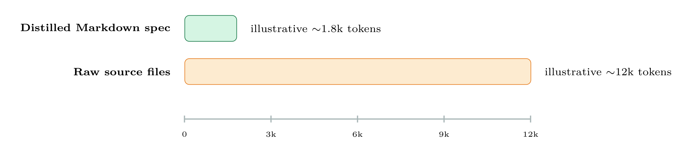

# DE10-Standard LCD Message System

**Can AI-generated code be trusted in a deterministic FPGA↔HPS system?**
A simulation-gated, AI-assisted case study — built on the Terasic DE10-Standard for a physiotherapy treatment room.

[](LICENSE)
[](https://www.terasic.com.tw/cgi-bin/page/archive.pl?Language=English&No=1046)
[](https://www.intel.com/content/www/us/en/products/details/fpga/cyclone/v.html)
[]()
[]()
[]()

<p align="center">
  
</p>

---

## Abstract

AI-generated code is increasingly useful in engineering workflows, but its use in a **deterministic FPGA–HPS embedded system** raises a practical question: can generated RTL and HPS software be trusted without systematic verification? A plausible-looking error can cross the hardware/software boundary and become very hard to diagnose once it's on a board.

This project treats AI generation as a **drafting tool, not evidence of correctness**. AI tools (Claude Code for Verilog/RTL, Codex for the HPS C application) draft every module, but nothing reaches hardware until it passes a dedicated simulation gate. The vehicle for the case study is a real, working system: an LCD message board for a physiotherapy room, running on the DE10-Standard's hybrid FPGA + HPS (ARM Cortex-A9) architecture, driven by 4 pushbuttons wired to the FPGA fabric.

**Result:** all five quantitative requirements were met at first power-on, with zero hardware bugs — worst-case display latency of 42 ms, 7% FPGA logic utilization, and 0 errors across 10,000 bridge-communication reads.

## Table of Contents

- [At a Glance](#at-a-glance)
- [System Block Diagram](#system-block-diagram)
- [Inside the FPGA — the Real-Time Datapath](#inside-the-fpga--the-real-time-datapath)
- [Register Map](#register-map)
- [Finite State Machine](#finite-state-machine)
- [HPS Software — Reading the Board, Updating the LCD](#hps-software--reading-the-board-updating-the-lcd)
- [Development Methodology: Simulation-Gated AI-Assisted Design](#development-methodology-simulation-gated-ai-assisted-design)
- [What the Prompts Reveal](#what-the-prompts-reveal)
- [The Real Hardware](#the-real-hardware)
- [Verification & Results](#verification--results)
- [Project Architecture](#project-architecture)
- [Repository Structure](#repository-structure)
- [Build Instructions](#build-instructions)
- [Simulation Verification (Pre-Hardware)](#simulation-verification-pre-hardware)
- [Hardware Validation (Presentation Sign-off)](#hardware-validation-presentation-sign-off)
- [Future Work](#future-work)
- [References](#references)
- [Credits](#credits)

## Recent Highlights

*   **Per-message auto-advance slideshow**: each message now displays for its own configurable duration (`msg_duration_rom.v`) before automatically advancing to the next — a real hardware-timed slideshow, not just a static screen. Manual KEY1/KEY2/KEY0 navigation always takes priority.
*   **60-second Home inactivity timeout** (previously 15s): only the Home screen sleeps on inactivity now; the message slideshow keeps cycling on its own instead of sleeping.
*   **On-board demo indicators**: HEX0/HEX1 now show the active message number, and LEDR[9] blinks on every countdown expiry — both tie the physical board directly to what's happening on the LCD.

## At a Glance

| | | | | |
|---|---|---|---|---|
| **18** stored messages | **4** navigation buttons | **42 ms** worst-case latency (target < 50 ms) | **7%** FPGA logic used (3,073 / 41,910 ALMs) | **0** errors / 10,000 bridge reads |

Buttons wire only to the FPGA; the LCD wires only to the HPS — that physical fact, not a preference, set the whole architecture.

## System Block Diagram

<p align="center">
  
</p>

The Cyclone V SoC combines FPGA fabric and an HPS (Hard Processor System) on one silicon die. The FPGA owns the real-time control path — button debouncing, edge detection, FSM, message indexing, and the countdown timer — and exposes read-only status registers. The HPS is the bridge master: it polls those registers over the **Lightweight HPS-to-FPGA Bridge** (`0xFF200000`, a 32-bit Avalon-MM port, accessed from Linux via `mmap()` on `/dev/mem`) and renders the current message to the LCD. No writes flow from HPS to FPGA — the HPS has no authority over control transitions.

## Inside the FPGA — the Real-Time Datapath

<p align="center">
  
</p>

A four-stage button-processing pipeline, encapsulated in a single wrapper module (`fpga_msg_controller.v`):

*   **`button_debouncer.v`** — 20 ms stability-counter debounce for all four KEYs. At a 50 MHz clock, the threshold is `N = f_clk × t_window = 50×10⁶ × 20×10⁻³ = 1,000,000 cycles`.
*   **`button_edge_detector.v`** — converts a debounced level into a single-cycle pulse (exactly one pulse per physical press).
*   **`message_fsm.v`** — 5-state Moore FSM; reloads the countdown timer and picks the message index.
*   **`idle_timer.v`** — runtime-loadable countdown: 60 s on HOME/IDLE, or the current message's own duration in MSG.
*   **`msg_duration_rom.v`** — per-message duration lookup table (0–17), reloads the timer in MSG state.
*   **`hex_display.v`** — decodes timer seconds, last button, and message number onto the onboard 7-segment displays.

In MSG state, the message index also selects a per-message duration from the ROM to reload the timer; HOME/IDLE expiry sends the FSM to SLEEP. The HPS reads FSM state, message index, and countdown value over the Lightweight Bridge — it only ever reads.

## Register Map

The HPS communicates with the FPGA via the Lightweight H2F Bridge (Base: `0xFF200000`).

<p align="center">
  
</p>

| PIO Name | Offset | Width | Direction | Description |
|---|---|---|---|---|
| `button_pio` | `0x5000` | 4-bit | Input (Original) | Raw button inputs. |
| `fsm_status_pio` | `0x6000` | 8-bit | Input | Bits [7:5]: FSM State. Bits [4:0]: FSM Message Index. |
| `timer_status_pio` | `0x7000` | 8-bit | Input | Bit [0]: Timeout Flag (1=Expired). Bits [6:1]: Seconds Remaining (0-63). Bit [7]: reserved. |

All register accesses are declared `volatile` in the HPS C application to prevent the compiler from caching values between polling cycles. This exact bit-field contract — stated explicitly, not left implicit — is what the "Register mismatch" defect below was missing.

## Finite State Machine

<p align="center">
  
</p>

The UI is controlled by a 5-state **Moore FSM** — outputs depend only on the current state, never directly on the inputs — so an HPS read at any time returns a stable, well-defined value without needing to observe the transition inputs.

| State | Meaning |
|---|---|
| INIT | Power-on / reset |
| IDLE | Transient startup state, auto-advances to HOME |
| HOME | Idle screen; 60s inactivity timeout leads to SLEEP; any button leads to MSG |
| MSG | Displaying one of 18 messages; auto-advances (with wrap-around) on that message's own duration; KEY1/KEY2 navigate manually |
| SLEEP | LCD blanked after HOME inactivity; any button wakes to IDLE |

**On a tie, the button always beats the timer** — exactly the rule an early AI draft got backwards (see [defects table](#what-the-prompts-reveal) below).

## HPS Software — Reading the Board, Updating the LCD

<p align="center">
  
</p>

The HPS runs a single-threaded C application (`main.c`) compiled for ARM Linux. At startup it `mmap()`s the Lightweight Bridge window and declares every PIO pointer `volatile`. The state field is extracted as `(fsm_status >> 5) & 0x07` and the message index as `fsm_status & 0x1F`. No message text ever crosses the bridge: all 18 strings live in `messages.h` on the HPS side, and the FPGA exposes only the 5-bit index. Simple on purpose — check the board, and redraw only when the state actually changed, every 5 ms, continuously.

## Development Methodology: Simulation-Gated AI-Assisted Design

<p align="center">
  
</p>

AI tools were used to generate first-draft Verilog modules and the HPS C application — Verilog/RTL with **Claude Code**, the HPS C application with **Codex**, matching each tool to its target language. A draft was accepted only after it passed its required checks; AI output was never treated as proof of correctness on its own.

**The rule that made this trustworthy: no code reaches the board until its test passes.** Two feedback loops, not one — a failing test revises the prompt, and a hardware-level bug loops all the way back to generation. This gate is why hardware bring-up required zero bug-fix loops.

### No single gate was enough

<p align="center">
  
</p>

Six narrowing checks, each catching a different class of defect. Lenient, early checks on the left; strict, late checks on the right — simulation alone would have missed the timing and real-time cases that only the Quartus fitter and hardware bring-up could expose.

### Defects found in AI-generated code, and how each was caught

| # | Defect | Caught by | Fix | Root cause |
|---|---|---|---|---|
| 1 | LCD assumed connected directly to FPGA GPIO | Board wiring review | Switched to the FPGA/HPS split architecture | Prompt omitted the real board wiring |
| 2 | Register bit-field layout mismatch between FPGA and HPS | Wrong text on LCD | Corrected the shared register contract | Prompt gave no exact bit-field contract |
| 3 | Bit-width mismatch between modules | Verilator lint | Fixed signal widths | Prompt set no explicit signal widths |
| 4 | Failed timing closure after synthesis | Quartus timing report | Rewrote the critical logic path | Prompt stated no timing/f_max constraint |
| 5 | Stale text left on LCD after a state change | Manual screen check | Fixed redraw ordering in the HPS render loop | Prompt never specified redraw ordering |
| 6 | Missed button press arriving on the same cycle as a timer expiry | Dedicated edge-case test | Fixed timer/priority comparison so button events always win | Prompt named no simultaneity / button-priority rule |

Every defect traced back to an under-specified prompt — never a model capability limit. The fix was always a more complete, constraint-aware prompt rather than a different model.

## What the Prompts Reveal

The prompts themselves predicted the defects: omitted constraints produced omitted behavior.

> **Weak — Architecture**
> *"Design an LCD control system on the DE10-Standard board using a Nios II soft-core processor to drive the display."*
> No wiring facts, so the model fell back on a generic Nios II tutorial pattern.
>
> **Strong — Architecture**
> *"...The KEY[0–3] buttons are wired only to FPGA fabric pins, and the LCD is wired only to the Processor."*
> The wiring is stated as fact — no room for an assumption.

> **Weak — Timeout Edge**
> *"Add timeout handling so the display sleeps after inactivity and advances messages automatically."*
> Names the feature but never the arbitration rule — the bug only appears when two valid events coincide on one clock cycle.
>
> **Strong — Timeout Edge**
> *"...with explicit priority. If a button event and a timer expiry occur on the same clock cycle, the button event must win. HOME/IDLE timeout enters SLEEP; MSG timeout advances to the next message and stays in MSG."*
> States the state-dependent behavior *and* the tie-break rule — which makes it testable in simulation.

This is also a token-efficiency lesson: a distilled Markdown spec (architecture, register contract, timing rules) carries the constraints an AI needs in a fraction of the tokens raw source files would cost.

<p align="center">
  
</p>

## The Real Hardware

<p align="center">
  
</p>

Color key: **yellow** = character LCD (HPS side) · **orange** = HEX display (FPGA side) · **magenta** = KEY pushbuttons (FPGA side) · **red** = Cyclone V FPGA/SoC area · **blue** = GPIO expansion header · arrows show the USB programming cable, board power input, microSD/Linux boot media, and the HPS-side external link.

## Verification & Results

Eight Verilog testbenches were required to pass with zero errors before any module reached hardware:

*   `tb_button_debouncer.v` — 20ms debounce window; zero re-triggers across 10 bounce sequences.
*   `tb_button_edge_detector.v` — exactly one pulse per physical press.
*   `tb_message_fsm.v` — all state transitions, including auto-advance wrap and sleep.
*   `tb_idle_timer.v` — runtime-loaded countdown, HOME timeout, MSG reload and wrap.
*   `tb_hex_display.v` — correct 7-segment decode for digits 0-9.
*   `tb_soc_register_contract.v` — FPGA/HPS register bit-field agreement.
*   `tb_fpga_msg_controller.v` — end-to-end button-to-state pipeline.
*   `tb_clock_divider.v` — 1Hz output within ±1 cycle of 50MHz/50M.

Hardware results (DE10-Standard, Cyclone V 5CSXFC6D6F31C6), all measured on the physical board — worst-case display latency was camera-measured at 240 fps (each frame = 4.2 ms):

| Metric | Result | Target |
|---|---|---|
| Display update latency | 42ms worst-case | < 50ms |
| FPGA logic utilization | 7% (3,073 / 41,910 ALMs) | < 75% |
| Bridge communication reliability | 0 errors across 10,000 read cycles | 0 errors |
| Button debounce | 0 false triggers | 0 re-triggers |
| Hardware bugs at first power-on | 0 | — |

**All five requirements met at first power-on.** The 10,000-read bridge test confirms static-value read stability but does not exercise every bit line or simultaneous bit-switching — see [Future Work](#future-work) for the walking-ones stress test that would close that gap.

## Project Architecture

The system uses a hybrid FPGA + HPS architecture:

*   **FPGA Logic**: Handles real-time tasks independently of the OS.
    *   **20ms Debouncer**: Filters button noise (2-FF synchronizer + counter-based stability check).
    *   **Button Edge Detector**: Converts debounced button levels into single-cycle press pulses.
    *   **Idle Timer**: Runtime-loadable countdown — 60s Home inactivity timeout, or (while a message is shown) that message's own display duration.
    *   **Message Duration ROM**: Compile-time lookup table giving each of the 18 messages its own display duration in seconds.
    *   **UI FSM (Verilog)**: Implements INIT/IDLE/HOME/MSG/SLEEP states and message index navigation; MSG auto-advances on timeout instead of sleeping, only HOME sleeps.
    *   **HEX Display Driver**: Outputs system status (timer countdown, current message number, last button, timeout flag) to onboard 7-segment displays.
*   **HPS Software**: Acts as LCD renderer and diagnostics client.
    *   Reads FPGA-exported FSM and timer status registers via the Lightweight HPS-to-FPGA (LW) Bridge.
    *   Renders LCD content based on hardware state and message index.
    *   Performs runtime sanity checks/warnings without owning control transitions.

### Hardware Components

*   `button_debouncer.v`: Parameterized debouncer module.
*   `button_edge_detector.v`: Rising-edge detector for one-pulse-per-press behavior.
*   `idle_timer.v`: Countdown timer with a runtime-loadable starting value, enable/reset.
*   `msg_duration_rom.v`: Per-message display duration lookup table (hand-edited, same workflow as editing message text).
*   `message_fsm.v`: Verilog UI control FSM — HOME timeout sleeps, MSG timeout auto-advances (wrap), buttons always take priority.
*   `hex_display.v`: BCD-to-7-segment decoder.
*   `fpga_msg_controller.v`: Top-level wrapper integrating all FPGA modules.
*   `DE10_Standard_GHRD.v`: Top-level system instantiation connecting RTL to HPS via Qsys.

### Software Components

*   `main.c`: HPS LCD renderer that consumes FPGA status PIO registers (`0x6000`, `0x7000`).
*   `Makefile`: Build script for cross-compilation or on-board compilation.

## Repository Structure

```
Fpga_project_DE10_Standard_LCD_MSGS/
├── hw/
│   ├── rtl/            Verilog RTL modules
│   └── quartus/        Quartus project + pin assignments
├── sw/
│   └── hps_app/        HPS C application + Makefile
├── sim/
│   └── testbenches/    8 Verilog simulation testbenches
├── scripts/             Build, deployment, and hardware sign-off automation
├── docs/
│   ├── diagrams/        Standalone TikZ/LaTeX source for every diagram below
│   ├── images/          Rendered diagrams + real hardware photos
│   └── *.md             Architecture, requirements, verification, runbooks
└── README.md
```

Every diagram in this README has its LaTeX/TikZ source checked in under [`docs/diagrams/`](docs/diagrams/), so it can be edited and recompiled directly instead of redrawn from scratch — see that folder for the `pdflatex` command to rebuild.

## Build Instructions

### 1. Build FPGA System (Windows)

An automated PowerShell script fixes Qsys and compiles the design.

Open PowerShell in the project root and run:

```
.\hw\quartus\fix_then_build.ps1
```

This script will:

*   Validate or repair `soc_system.qsys` PIO connectivity as needed.
*   Regenerate the HDL.
*   Compile the Quartus project to generate `DE10_Standard_GHRD.sof`.

Program the FPGA using Quartus Programmer.

### 2. Build HPS Software (Linux/Board)

```
cd sw/hps_app
make
./lcd_msg_app
```

### 3. Build HPS Software (Windows via WSL cross-compile)

If you are on Windows, do not run `make` directly in PowerShell/CMD unless you have a full ARM-Linux cross toolchain installed. The simplest supported path is WSL (Ubuntu) + `arm-linux-gnueabihf-gcc`.

Install toolchain inside WSL (run once):

```
sudo apt-get update
sudo apt-get install -y make gcc-arm-linux-gnueabihf binutils-arm-linux-gnueabihf libc6-dev-armhf-cross
```

Build from Windows by invoking WSL:

```
wsl -d Ubuntu -- bash -lc "cd /mnt/c/Fpga_project_DE10_Standard_LCD_MSGS_-V2/sw/hps_app && make clean && make CC=arm-linux-gnueabihf-gcc"
```

The file you copy to the SD card is the single ARM-Linux executable: `sw/hps_app/lcd_msg_app`

## Simulation Verification (Pre-Hardware)

Run these from the project root before board testing.

Preflight simulator tools:

```
.\sim\check_sim_env.ps1
```

Run canonical simulation regression:

```
.\sim\run_all_sim.ps1
```

Optional: include legacy suites:

```
$env:RUN_LEGACY = "1"
.\sim\run_all_sim.ps1
```

Full project verification (static checks + simulation gate):

```
$env:STRICT_SIM = "1"
.\verify_all.ps1
```

Automated waveform analysis report (VCD checks + summary markdown):

```
.\sim\run_wave_analysis.ps1
```

Report output: `sim/results/wave_analysis_report.md` — guide: `docs/waveform_analysis_guide.md`

Quartus 21.1 bundled Questa regression (canonical suites):

```
.\sim\run_quartus_questa_sim.ps1
```

Quartus-linked simulation collateral generation + Questa regression:

```
.\sim\run_quartus_questa_sim.ps1 -GenerateQuartusNetlist
```

Generated Quartus simulation netlist: `hw/quartus/sim/eda_questa/DE10_Standard_GHRD.vo`

One-command pre-board verification gate (canonical + legacy + waveform + Quartus netlist):

```
.\sim\run_pre_board_verification.ps1
```

Summary report: `sim/results/pre_board_verification_report.md`

If `iverilog` and `vvp` are installed but not in PATH, a temporary shell-only fix is:

```
$env:Path = "C:\iverilog\bin;" + $env:Path
```

## Hardware Validation (Presentation Sign-off)

To close hardware-only evidence items (for example, button-to-LCD end-to-end latency), use:

*   Runbook: `docs/board_validation_runbook.md`
*   Demo checklist: `docs/demo_dry_run_checklist.md`
*   Latency summary tool: `.\scripts\hardware\latency_summary.ps1 -CsvPath .\artifacts\hardware\latency_samples.csv -TargetMs 50`
*   Sign-off report generator: `.\scripts\hardware\generate_signoff_report.ps1`
*   One-command board sign-off runner: `.\scripts\hardware\run_board_signoff.ps1 -LatencyCsvPath .\artifacts\hardware\latency_samples.csv -LatencyTargetMs 50`
*   Finalize parity matrix statuses when board evidence is complete: `.\scripts\hardware\finalize_signoff.ps1`
*   Optional helpers for fast board logging: `.\scripts\hardware\reset_latency_samples.ps1`, `.\scripts\hardware\append_latency_sample.ps1 -SampleId 1 -KeyId KEY1 -LatencyMs 31.2 -Tool scope -Confidence HIGH -Notes home_to_msg`

Note: `append_latency_sample.ps1` removes seeded template rows automatically unless `-KeepTemplateRows` is specified. The summary output can be attached directly to the parity matrix and final verification package.

If Qsys generation fails, refer to `hw/quartus/README_QSYS_FIX.txt` for manual repair instructions. The `build_fpga.ps1` script is an alternative if you have already fixed Qsys manually.

## Future Work

Only 7% of the FPGA is in use today — plenty of room for extensions on the same board:

*   **VGA graphical display** — icons and animations via an M10K framebuffer and a 640×480 sync generator, not just text.
*   **Wi-Fi message streaming** — an ESP8266/ESP32 on the HPS UART receives live updates from a web dashboard, no physical board access needed.
*   **Audio feedback** — a speaker/buzzer via GPIO sounds a tone on state transitions and alerts.
*   **Touchscreen input** — capacitive touch over SPI removes mechanical buttons and enables gesture navigation.
*   **SD card message library** — replace the 18 hard-coded strings with a FAT SD-card library so non-technical users can edit content directly, no recompile.
*   **Power management** — gate inactive FPGA modules during SLEEP and lower HPS `cpufreq`; targets a 30–40% power cut for battery installations.
*   **Exhaustive bridge-integrity test** — a walking-ones pattern across all bridge bit lines plus simultaneous-switching stress, closing the gap left by the current static-value reliability check.
*   **Scope-based hardware coverage** — a systematic logic-analyzer coverage campaign to formalize what hardware bring-up currently confirms only informally.

## References

1. Intel Corporation, *Cyclone V Device Handbook, Volume 1: Device Interfaces and Integration*, Doc. ID CV-5V2, 2020.
2. Terasic Technologies, *DE10-Standard User Manual*, v1.0, 2017.
3. Intel Corporation, *Platform Designer (Qsys) User Guide*, Doc. ID UG-20181, Quartus Prime 21.1, 2021.
4. Intel Corporation, *Avalon Interface Specifications*, Doc. ID MNL-AVABUSREF, 2021.
5. Terasic Technologies, *DE10-Standard FPGA Board Schematic*, Rev. A, 2017.
6. M. M. Mano and M. D. Ciletti, *Digital Design with an Introduction to the Verilog HDL, VHDL, and SystemVerilog*, 6th ed., Pearson, 2018.
7. Y. Zhang, Y. Xiao, and L. Zhang, "Prompt Engineering Best Practices for Code Generation Tools," *Int. J. Emerging Technology and Computer Science and Information Technology*, 2024.
8. Z. Zhang et al., "LLM Hallucinations in Practical Code Generation: Phenomena, Mechanism, and Mitigation," arXiv:2409.20550, 2024.
9. N. F. Liu et al., "Lost in the Middle: How Language Models Use Long Contexts," *TACL*, vol. 12, pp. 157–173, 2024.
10. H. Jiang et al., "LLMLingua: Compressing Prompts for Accelerated Inference of Large Language Models," *Proc. EMNLP*, 2023.

## Credits

Built by **Amit Damari** and **Ido Zylberman**, advised by **Eytan Mann** — Digital Systems Laboratory, Faculty of Engineering, Tel Aviv University. Project 3420, EE Final Year, 2025–26.

## License

Released under the [MIT License](LICENSE).
