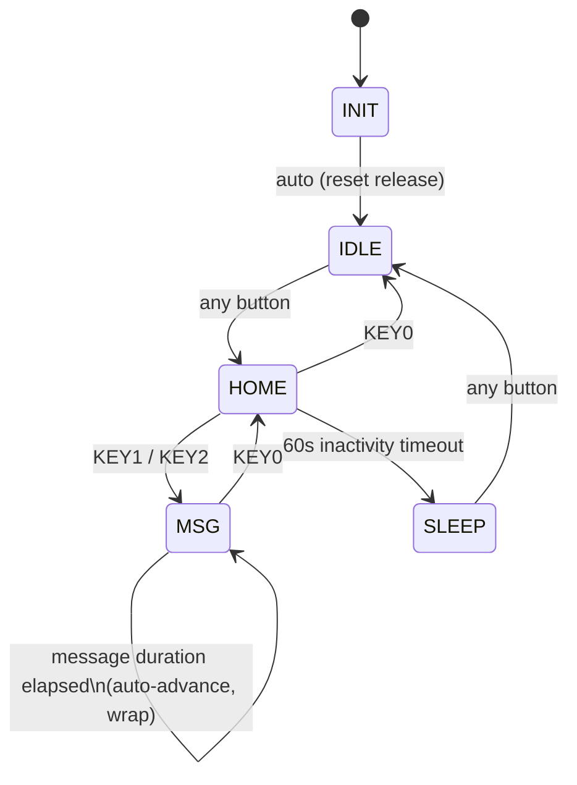

# DE10-Standard LCD Message System V2 - Architecture

## 1. System Partitioning

The design uses a hybrid SoC partition where FPGA fabric owns real-time control and HPS performs LCD rendering.

- FPGA (control authority): debouncing, edge detection, idle timeout, UI FSM transitions, and HEX status outputs.
- HPS (renderer/observer): reads FPGA status registers and renders LCD content for current state/index.

This partition keeps timing-critical behavior deterministic in hardware and removes OS scheduling jitter from control transitions.

## 2. FSM State Diagram

Implemented in `hw/rtl/message_fsm.v`. Buttons always take priority over a timeout that would occur on the same cycle.

## 3. Functional Data Flow

1. KEY[3:0] inputs (active-LOW) enter `button_debouncer.v` and are synchronized/filtered.
2. Debounced active-HIGH levels feed `button_edge_detector.v` to produce one-cycle press pulses.
3. Press pulses drive:
	- `idle_timer.v` reload path (any button press reloads and restarts the countdown).
	- `message_fsm.v` transition path (button-driven navigation across UI states).
4. `message_fsm.v` exports:
	- FSM state (`INIT/IDLE/HOME/MSG/SLEEP`).
	- Message index for LCD content selection.
5. `fpga_msg_controller.v` aggregates timer/FSM/status and drives HEX outputs. It also selects `idle_timer`'s runtime countdown-start value (`load_value`): the fixed `TIMEOUT_SEC` (default 60s) while in HOME/IDLE, or the current message's own duration (from `msg_duration_rom.v`, indexed by `msg_index`) while in MSG. In MSG, timeout no longer sleeps the system — it auto-advances `msg_index` to the next message (wrap-around), driving a slideshow. Only HOME's timeout still transitions to SLEEP.
6. SoC wrapper exports packed status through Avalon PIOs:
	- `fsm_status_pio`: [7:5]=state, [4:0]=msg_index.
	- `timer_status_pio`: [7]=reserved, [6:1]=seconds remaining (0-63), [0]=timeout.
7. HPS app (`main.c`) polls these registers and renders the corresponding LCD frame.

## 4. RTL Modules

- `hw/rtl/button_debouncer.v`: 2-FF synchronizer + stability counter, default 20 ms window.
- `hw/rtl/button_edge_detector.v`: rising-edge one-shot pulse generation.
- `hw/rtl/idle_timer.v`: parameterized countdown with a runtime-loaded starting value (`load_value`), timeout assert/clear behavior.
- `hw/rtl/msg_duration_rom.v`: compile-time lookup table giving each message (indexed the same way as `sw/hps_app/messages.h`) its own display duration in seconds. Hand-edited and re-synthesized, like message text — deliberately not a runtime-programmable register, to avoid Qsys/Platform Designer changes.
- `hw/rtl/message_fsm.v`: 5-state Verilog FSM. Buttons take priority over timeout. HOME's timeout transitions to SLEEP; MSG's timeout auto-advances `msg_index` (wrap-around) and stays in MSG.
- `hw/rtl/hex_display.v`: active-LOW 7-segment encoder.
- `hw/rtl/fpga_msg_controller.v`: integration wrapper; selects the timer's `load_value` by FSM state, converts the raw timeout level into a single-cycle pulse for `message_fsm`, and drives the timer's reload strobe (any button press, or an in-MSG auto-advance) so a freshly-shown message always reloads with its own duration.

## 5. SoC Interface Contract

Lightweight H2F bridge base: `0xFF200000`

- `button_pio` at `0x5000` (legacy raw buttons, input).
- `fsm_status_pio` at `0x6000` (8-bit input).
- `timer_status_pio` at `0x7000` (8-bit input).

Contract assumptions:

- Register packing is stable and verified by simulation contract tests.
- HPS must decode state/index exactly according to bit assignments above.

## 6. Timing and Ownership Rules

- Control transitions must originate in FPGA FSM logic.
- HPS must not override FSM transitions; it may only render based on observed hardware state.
- Timer reload source is any button pulse, OR (while in MSG) `msg_index` auto-advancing on timeout. A plain state change with no button press (e.g. HOME's own timeout into SLEEP) must NOT reload the timer.

## 7. Build/Integration Notes

- Platform Designer system is defined in `hw/quartus/soc_system.qsys`.
- Top-level SoC wiring is in `hw/quartus/DE10_Standard_GHRD.v`.
- Quartus source inclusion is controlled by `hw/quartus/DE10_Standard_GHRD.qsf`.

## 8. Verification Linkage

- Functional requirements are defined in `docs/requirements.md`.
- Requirement-to-test mapping and sign-off evidence live in `docs/verification_report.md`.
